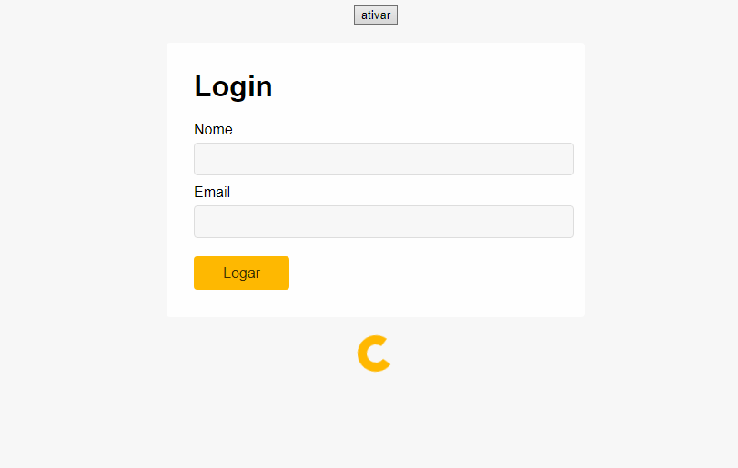

# Animações

Estudo sobre animações utilizando html, css javascript

Nesse estudo foi criado uma tela simples de login (sem funcionalidades) para treinar animações.

Foi criado um loading que fica carregando infinitamente e também um botão que faz a animação de login acontecer;

